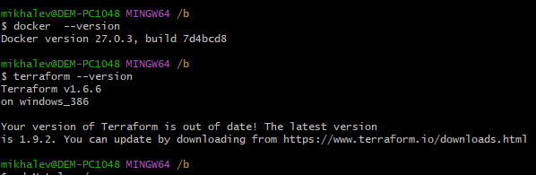

# Домашнее задание к занятию «Введение в Terraform»- Михалёв Сергей

### Чек-лист готовности к домашнему заданию

1. Скачайте и установите **Terraform** версии ~>1.8.4 . Приложите скриншот вывода команды ```terraform --version```.
2. Скачайте на свой ПК этот git-репозиторий. Исходный код для выполнения задания расположен в директории **01/src**.
3. Убедитесь, что в вашей ОС установлен docker.

------

**Решение**

Решил попробовать выполнить задание в Windows 10 так как теоретически и Terraform и Docker- кроссплатформенные приложения.


 


 
