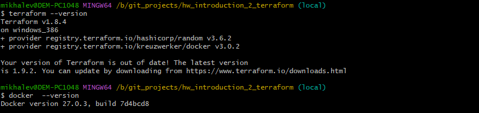
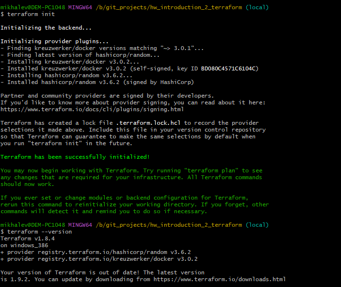
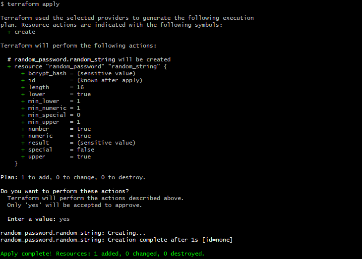
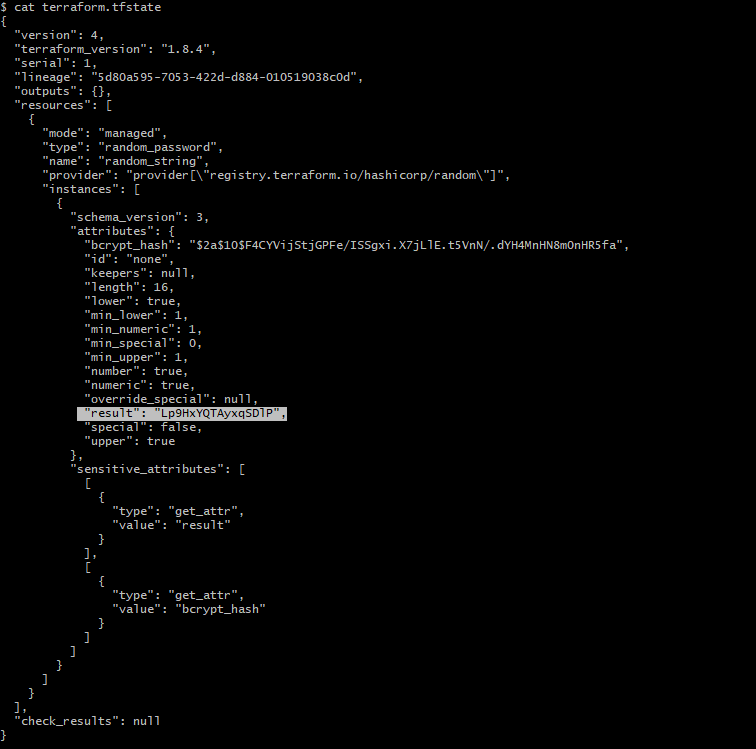

# Домашнее задание к занятию «Введение в Terraform»- Михалёв Сергей

### Чек-лист готовности к домашнему заданию

1. Скачайте и установите **Terraform** версии ~>1.8.4 . Приложите скриншот вывода команды ```terraform --version```.
2. Скачайте на свой ПК этот git-репозиторий. Исходный код для выполнения задания расположен в директории **01/src**.
3. Убедитесь, что в вашей ОС установлен docker.

------

**Решение**

Решил попробовать выполнить задание в Windows 10 так как теоретически и Terraform и Docker- кроссплатформенные приложения.


   


-----
### Задание 1

1. Перейдите в каталог [**src**](https://github.com/netology-code/ter-homeworks/tree/main/01/src). Скачайте все необходимые зависимости, использованные в проекте. 
2. Изучите файл **.gitignore**. В каком terraform-файле, согласно этому .gitignore, допустимо сохранить личную, секретную информацию?(логины,пароли,ключи,токены итд)
3. Выполните код проекта. Найдите  в state-файле секретное содержимое созданного ресурса **random_password**, пришлите в качестве ответа конкретный ключ и его значение.
4. Раскомментируйте блок кода, примерно расположенный на строчках 29–42 файла **main.tf**.
Выполните команду ```terraform validate```. Объясните, в чём заключаются намеренно допущенные ошибки. Исправьте их.
5. Выполните код. В качестве ответа приложите: исправленный фрагмент кода и вывод команды ```docker ps```.
6. Замените имя docker-контейнера в блоке кода на ```hello_world```. Не перепутайте имя контейнера и имя образа. Мы всё ещё продолжаем использовать name = "nginx:latest". Выполните команду ```terraform apply -auto-approve```.
Объясните своими словами, в чём может быть опасность применения ключа  ```-auto-approve```. Догадайтесь или нагуглите зачем может пригодиться данный ключ? В качестве ответа дополнительно приложите вывод команды ```docker ps```.
8. Уничтожьте созданные ресурсы с помощью **terraform**. Убедитесь, что все ресурсы удалены. Приложите содержимое файла **terraform.tfstate**. 
9. Объясните, почему при этом не был удалён docker-образ **nginx:latest**. Ответ **ОБЯЗАТЕЛЬНО НАЙДИТЕ В ПРЕДОСТАВЛЕННОМ КОДЕ**, а затем **ОБЯЗАТЕЛЬНО ПОДКРЕПИТЕ** строчкой из документации [**terraform провайдера docker**](https://docs.comcloud.xyz/providers/kreuzwerker/docker/latest/docs).  (ищите в классификаторе resource docker_image )

**Решение**
1. В файле *.gitignore* есть подсказка: *# own secret vars store*, там прописан файл для хранения переменных персональной авторизации- personal.auto.tfvars. Так же файлы *.tfstate и *.tfstate.* сохраняют состояние инфраструктуры и могут содержать конфиденциальные данные, такие как пароли и токены. Иногда следует добавлять файлы *.tfvars так как переменные так же могут содержать конфиденциальную информацию. Туда же можно добавлять файлы конфигурации CLI *.terraformrc*. Более полный список файлов можно найти в [официальной документации](https://github.com/github/gitignore/blob/main/Terraform.gitignore) Github.
2. Результат запуска *terraform init*
   
   
   
4. Результат запуска кода *terraform apply*

   

5. Ключ в файле *terraform.tfstate*

   


 
